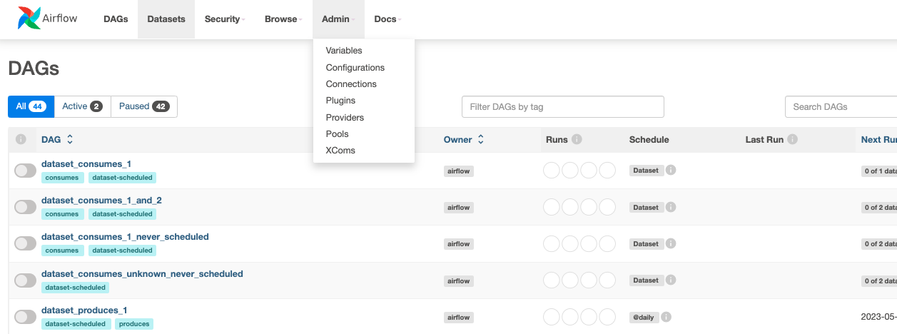

# How To Setup a New Connection in Airflow?

In the GUI go to the "Admin" at the top ribbon of the buttons and then pick "Connections":

For the course 
[The Complete Hands-On Introduction to Apache Airflow](https://www.udemy.com/course/the-complete-hands-on-course-to-master-apache-airflow/?couponCode=CP130525)
you will need the following connections:
1. `postgres`:

    a. `Connection Id`: `postgres`

    b. `Connection Type`: `postgres`

   c. `Host`: `postgres`

   d. `Login`: `airflow`
   
   e. `Password`: `airflow`

   f. `Port`: `5432`

2. `user_api`:

   a. `Connection Id`: `user_api`

   b. `Connection Type`: `HTTP`

   c. `Host`: `https://randomuser.me/`
